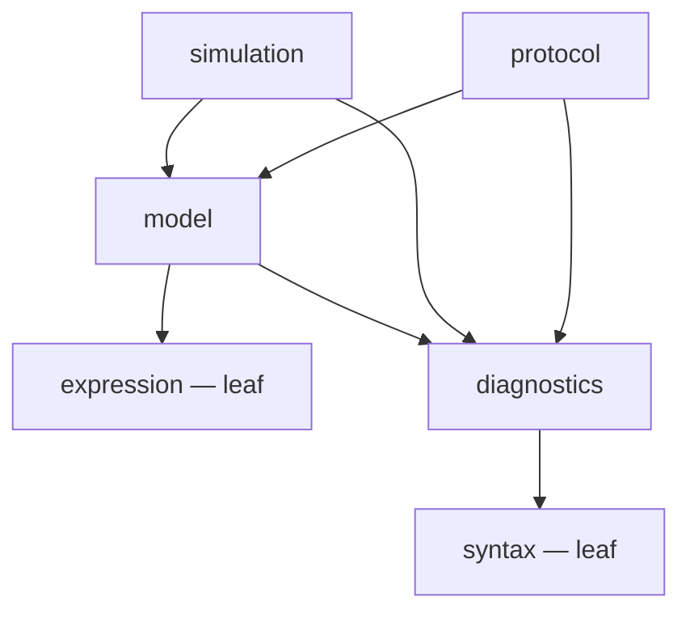
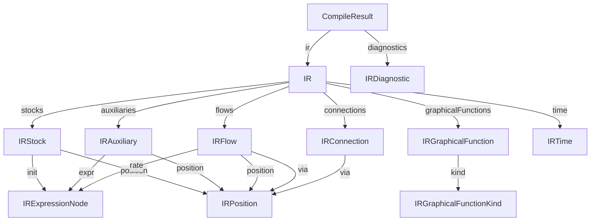

# @sysdml/contracts

The shared contract surface between SysDML packages.

## Inclusion rule

A type lives here **if and only if it crosses a package boundary** — it is imported by
a package other than the one that produces it. Package-private types stay in their owning
package. This package holds **no behavior**: only types plus the enums and const-tables
that define a contract's valid value-space (e.g. `DiagnosticCode`, `BUILTIN_*`).

## Domains

- `expression/` — the formula tree (`IRExpressionNode`) and the builtin-function tables.
- `syntax/` — parser output: `Span`, AST nodes, `Diagnostic`, `ParseResult`.
- `diagnostics/` — semantic diagnostics from compilation (`IRDiagnostic`) and simulation.
- `model/` — the system-dynamics model graph (`IR` and its parts) and `CompileResult`.
- `simulation/` — simulation output (`SimulationResult`, `SimRow`, `Simulator`).
- `protocol/` — serialized messages crossing process boundaries (extension ↔ webview).
  Runtime schemas land here when added.

## Domain dependency graph

The domains form an acyclic graph: leaves depend on nothing, and arrows point from a
domain to the domains it depends on. Generated from the actual cross-domain imports by
`scripts/generate-diagrams.mjs` — do not edit the block below by hand.

<!-- generated:domain-dag -->

<!-- /generated:domain-dag -->

## Model shape

How the `IR` model graph composes, and where the shared `IRExpressionNode` formula tree
is referenced — edge labels are the property names. Generated from the `model/` domain's
type definitions by `scripts/generate-diagrams.mjs` — do not edit the block below by hand.

<!-- generated:model-shape -->

<!-- /generated:model-shape -->
